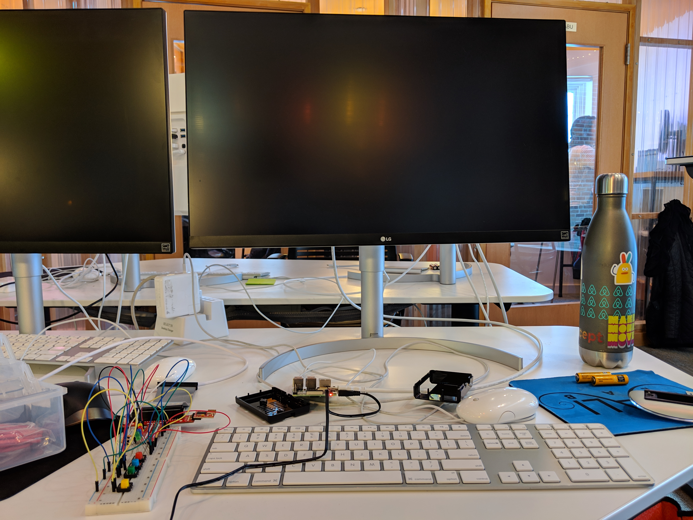
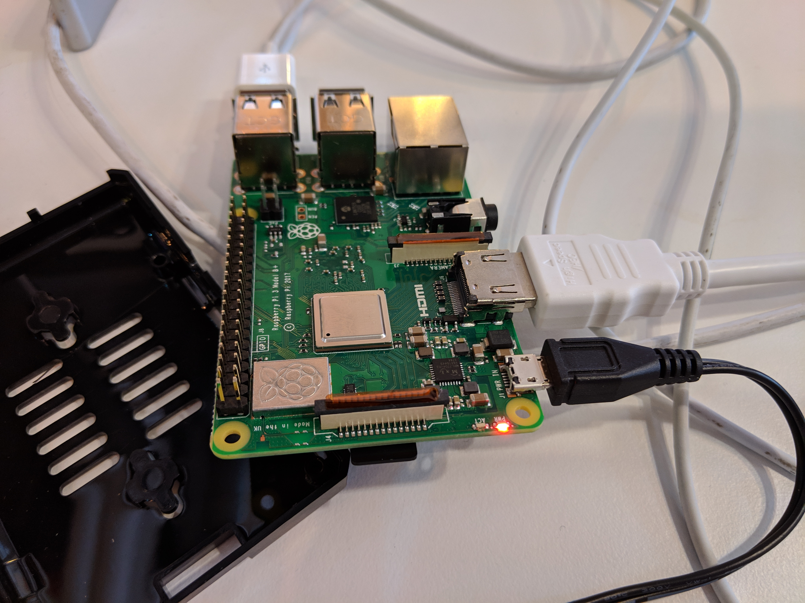
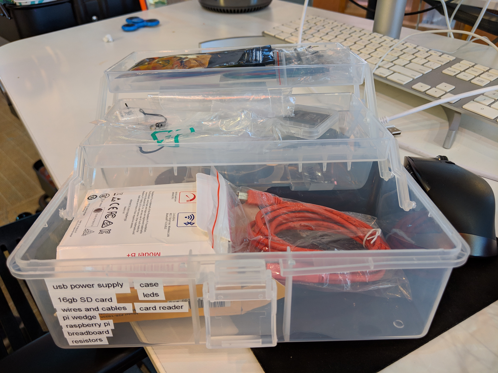
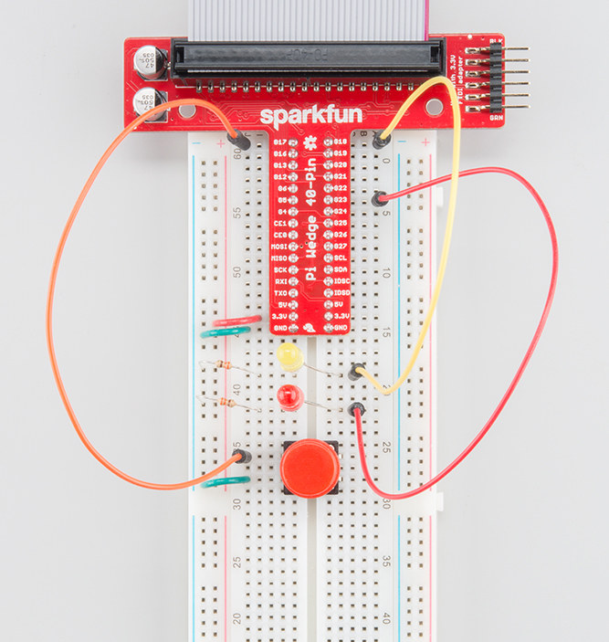
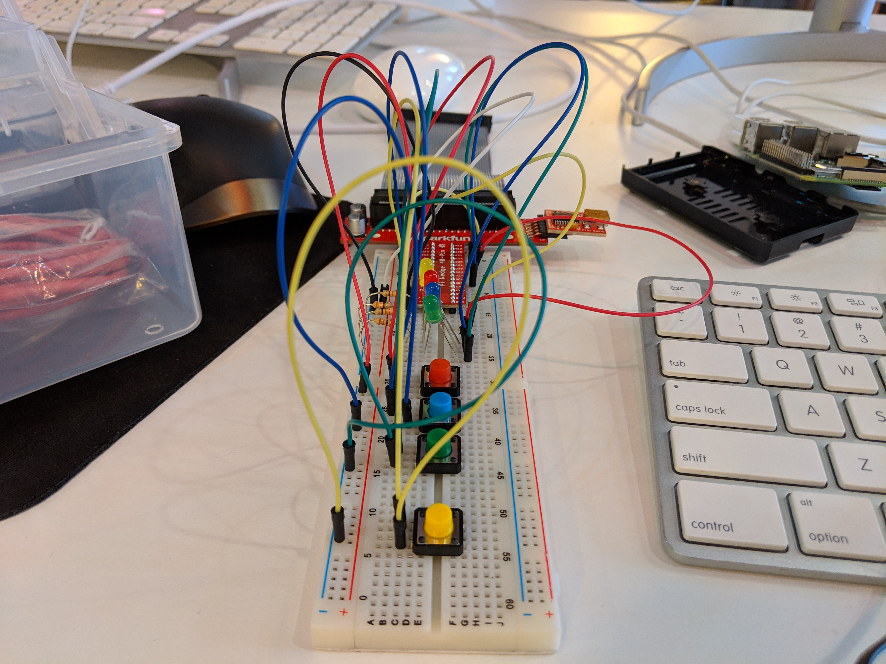

# R I P-berry Pi Anti-tutorial

This is a cautionary tale against what I did!! **DO NOT DO WHAT I DID AND BREAK A RASPBERRY PI!!!** 

## The beginning 

Interested in hardware projects, I got a Raspberry Pi! 10/10 setup instructions plus I had done it before, but here's how my station was setup.
.

Raspberry Pi is super cool!! It contains a 64-BIT QUAD CORE PROCESSOR for a p tiny package, and you can hookup a keyboard, mouse, monitor, headphones, ethernet cable, etc. I straightup will get my future kid one of these if they ever ask for a computer, because this is really all you need. 

I wish I had more pictures with it, but as I was setting up, I assumed I'd have more time with my Pi. Really teaches you to cherish time with loved ones because they can be gone any time. The Pi comes with a super simple OS aptly named NOOB, and its sole purpose is to connect you to internet to install another OS, kind of like the real life use case of Internet Explorer.

## The uneventful but delightful middle 

Again, no pictures because I thought I'd be able to DEMO this, but I installed Raspian and it was GR8. I installed multiple c0diNg apps as well as Minecraft. Here's the beautiful inside of the Pi (no longer functional).

## The start of the end

Wanting to do more with the kit pictured below, I started following [this tutorial](https://learn.sparkfun.com/tutorials/raspberry-gpio).

The tutorial gives a very good overview of how to program for the Pi's hardware components! I followed it closely with my minimal electrical engineerly experience, yielding a bread board like this one below after some trial and error.

With the `blink.py` script also from the tutorial, I programmed the red light to blink when the red button was pressed!! So fun. 

Armed with my new brilliance and invincibility, I set out to make a MORE advanced circuit. The end result looks something like this.

BUT my grand vision was never realized! In fact, the Raspberry Pi is no longer alive!! WHY HAS SUCH A TRAGEDY BEFALLEN UPON US, u may ask?? 

## A superficial overview of what happened

